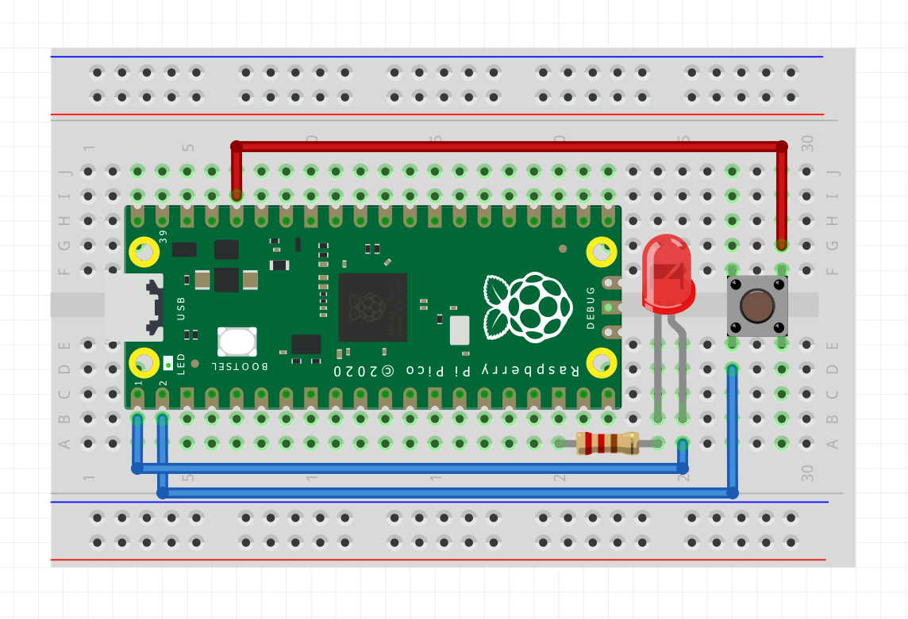
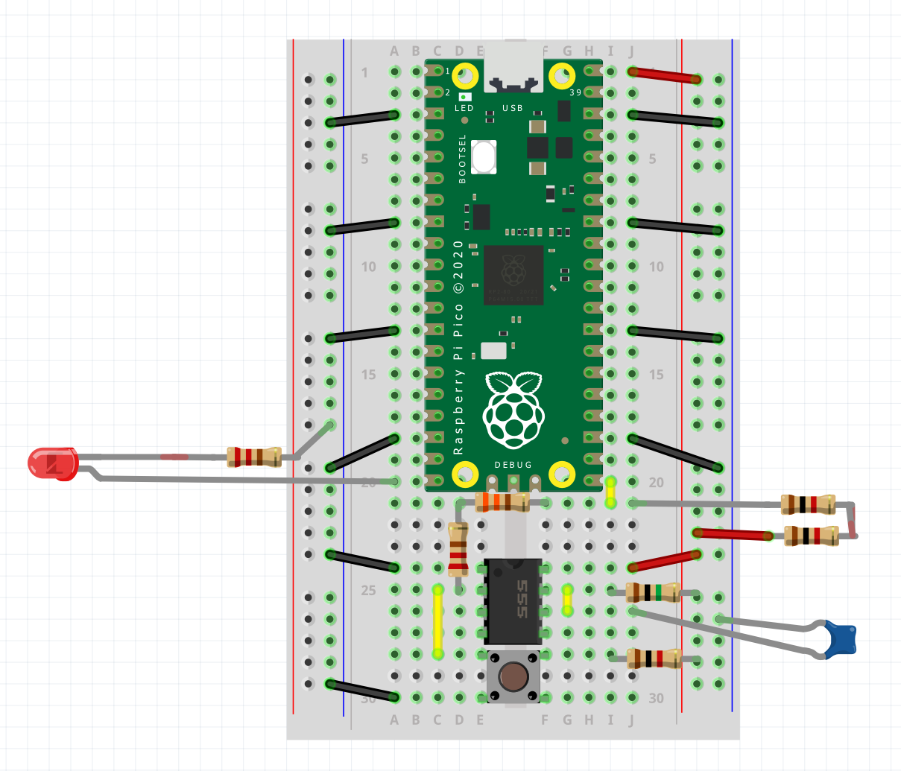

<!-- HEADER -->
# Fi(sh) Fo(od) Re(minder)

A project that helps remind me when it is time to feed my fish.

<!-- ABOUT THE PROJECT -->
## About the Project

A combination of hardware and software, the system uses a Raspberry Pi Pico, a push button, and an LED to periodically let the user know that it is time to feed their fish.

### Programmed With

This project was programmed in [MicroPython](https://docs.micropython.org/en/latest/), a language largely compatible with [Python 3](https://www.python.org/) that is optimized to run on a microcontroller.

<!-- GETTING STARTED -->
## Getting Started

The system can be built using off the shelf components, and the software can be uploaded using a free IDE. The behavior of the system can be easily modified by changing the main.py source file resulting in altered feed delays, indicator LED flash count, duration, etc.

The indicating LED should be lit solid after the device is powered and has had time to boot, indicating that a feeding needs to occur. It is recommended the device be powered at a feeding time for this reason.

### Feeding Events

A *feeding event* is said to be any time the user informs the system that a feeding took place. There are two methods of telling the system a feeding event occurred:

- One press of the button while indicating LED is lit: When a feeding needs to take place, the indicating LED will light up. One push of the button will signal to the system a feeding has occurred, the LED will flash three times acknowledging the event, and then turn off.

- Two presses of the button while indicating LED is unlit: A feeding event can be triggered manually but double pressing the button while the indicating LED is off. Similar to the first method of signaling a feeding event, the light will flash three times and shut off.

## Hardware

All hardware used in this project are off the shelf components that anyone can purchase online or an electronics shop.

### Component List

| Name | Quantity | Purpose |
|-|-|-|
| Raspberry Pi Pico | 1 | Microcontroller |
| Red LED | 1 | Indicates when a feeding needs to take place |
| Push Button | 1 | Input telling the system when a feeding has taken place |
| 220 ohm resistor | 1 | Limits current from breaking LED |
| Jumper Cables | Varies | Allows for connecting components to one another |

**Import Note**: Be sure to adjust the current limiting resistor sitting between the 3.3v output from the Pico and ground. A 220 ohm value is enough to keep the LED from burning out on the Red 3mm LED, but this isn't the case for diodes with different forward voltage drops.

### Optional Hardware Changes

#### Alternate Microcontrollers

Any microcontroller containing at least one GPIO input and one output is capable of running this system. It has so far been tested on a Raspberry Pi Pico and an ESP32.

#### Hardware Debouncing

If software debouncing is something that you'd like to avoid, a simple debouncing circuit for the push button can be built using an NE555 timer IC along with a handful of resistors, capacitors, and jumper wires. For more information, search for "astable oscillator using NE555 timer" or "how to build a debounce circuit using an NE555". 

### Software

The [Thonny](https://thonny.org/) IDE was used to program the system and upload the code to the Pico.

### Images

Yes, I am aware that the dou of 1k resistors wired in series adds to 2k, but I didn't have a 2k resistor installed in my Fritzing library. Additionally, the 330 and 220 ohm resistors in series along with the 2x1k (2k in real life) act as a voltage divider to bring the 5v signal output from the NE555 stepping it down below 3.3v as that is the maximum input voltage the Picos GPIO pins can handle.
